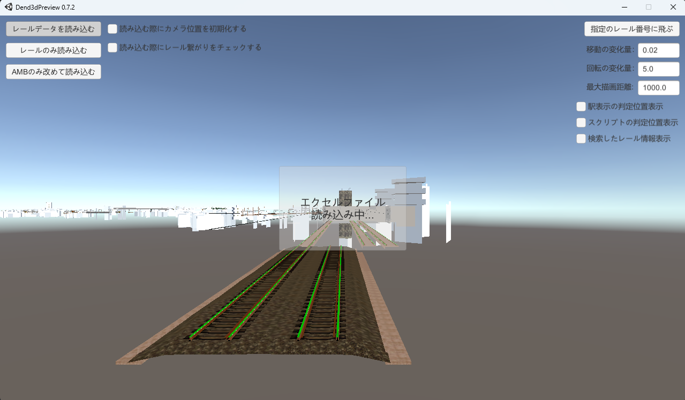
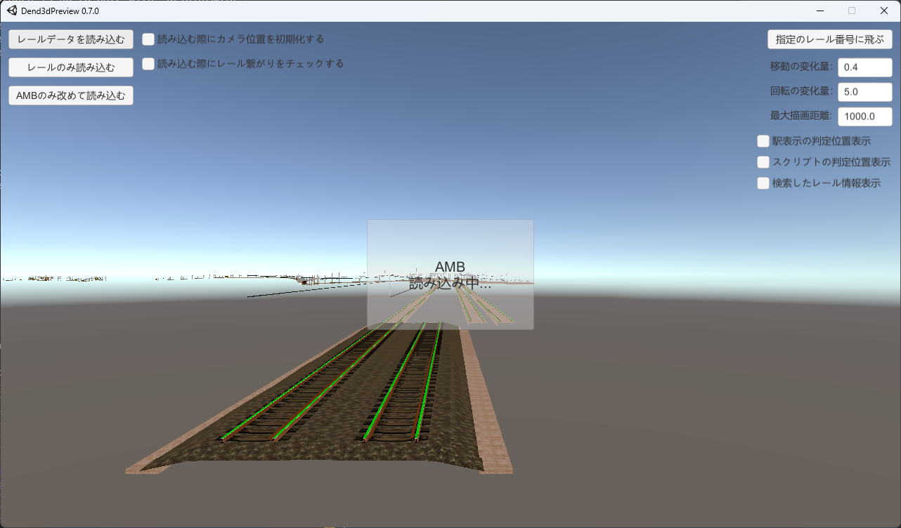

# Dend3dPreview

電車でD SSのレールデータを3DでプレビューするMODツール

# 注意書き

・必ずしも正確に表示されるとは限らないです。

・モデルのライトやMaterialの表示方法は、任意で設定したものであるため、実際のゲームと違いがあります。

# 操作方法

## マウス

・左クリックしながら移動：カメラを左右上下に平行移動

・ホイール：前後に平行移動

・右クリックしながら移動：カメラを左右上下に回転移動

## キーボード

・WASDキー：カメラを左右、前後に平行移動

・Q、Eキー：カメラを上下に平行移動

## 移動の変化量、回転の変化量

入力した数値分、動きます。移動の初期値は0.01、回転の初期値は3.0です。

初期値は「Dend3dPreview_Data/config.ini」で調整できます。

## 最大描画距離

入力した数値の距離分、描画します。初期値は1000.0です。

初期値は「Dend3dPreview_Data/config.ini」で調整できます。

## キーボード、マウスホイールのカスタム操作

「Dend3dPreview_Data/config.ini」で調整できる

| 操作 | 説明 | デフォルトキー(値) |
| --- | --- | --- |
| FORWARD_KEY | カメラを前へ動かす | w |
| BACKWARD_KEY | カメラを後ろへ動かす | s |
| LEFT_KEY | カメラを左へ動かす | a |
| RIGHT_KEY | カメラを右へ動かせる | d |
| UP_KEY | カメラを上へ動かせる | q |
| DOWN_KEY | カメラを下へ動かせる | e |
| MOUSE_WHEEL_FLAG | マウスホイールの動き | 0（デフォルト）、1（逆転させる） |

# Import package

このツールは、下記のパッケージ・ライブラリを使っています

* Quick Outline
  
  レール番号検索で見つけた場合、探したレールにアウトラインを付ける

* ExcelDataReader

  エクセルでステージデータを読込ませるため

# 余談

Assetsフォルダ以外は、ほぼUnityで自動で作成されるもの。

モデルのFBXファイルは、このソースに含まれていません。